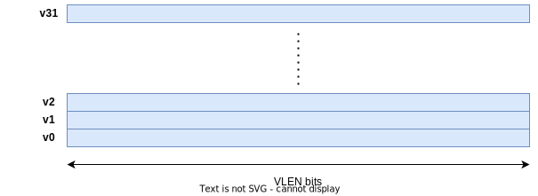
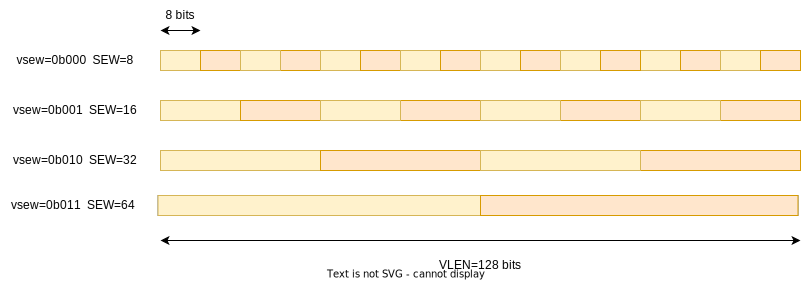
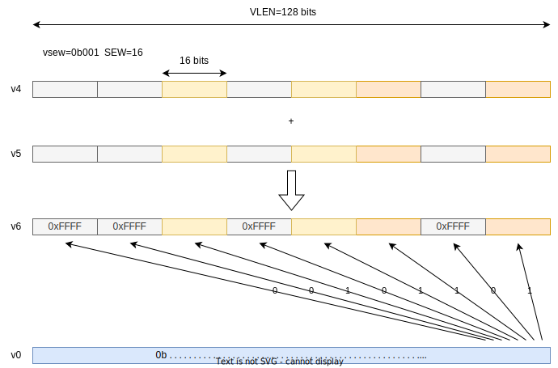
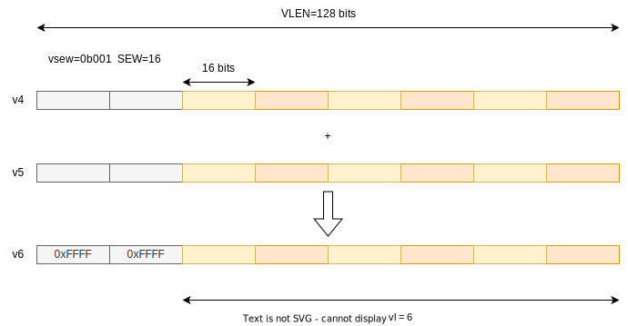
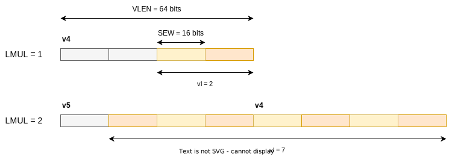

% RISC-V Vector Quick Intro
%
% 11th May 2025

This is a simple and quick intro to the RISC-V vector extension. Read to *The End* for a fun visualisation.

## Registers

There are 32 vector registers. `v0` is special in that it can optionally be used as a mask register. Each register is `VLEN` bits wide.

`VLEN` is an implementation-defined constant value that can't be changed at runtime. It must be a power of 2, and must be no greater than 65536. A typical value might be 128 or 512 bits.

There is a read-only constant CSR `vlenb` that contains `VLEN` in bytes (i.e. `VLEN/8`).

## Elements

Vector operations operate on *elements*, i.e. single numbers. The way vector registers can be grouped and divided into elements is really flexible.

The *maximum* element width in bits is `ELEN`. Like `VLEN`, `ELEN` is implementation-defined and constant. It must be a power of 2, and `VLEN ≥ ELEN ≥ 8`. So you are guaranteed to be able to operate on bytes, and you can't have an element that is bigger than a register. The maximum `ELEN` is 64, and in practice `ELEN` is probably 64.

The *Selected* Element Width is `SEW` (with `SEW ≤ ELEN`). This *can* be varied at runtime. There is a CSR called `vtype` that has a 3-bit field `vsew` to change `SEW`. This CSR is read-only, if accessed via the normal CSR functions. There are special `vset{i}vl{i}` instructions that are used to modify it.

For example if `VLEN=128`:

Widths higher than 64 are currently reserved, so you can't do calculations on 128-bit values.

## Masking and Vector Length

Sometimes you don't want to process all of the elements in a register group. There are two ways to select a subset: masking and vector length.

### Masking

Masking is activated using the mask version of an instruction. For example instead of

    vor.vv v1, v2, v3

we use

    vor.vv v1, v2, v3, v0.t

This sets the `vm` bit (bit 25) of the instruction opcode to `0` (masked) rather than `1` (unmasked).

> `v0.t` is the only option here. Only `v0` can be used for masking and the `.t` is supposed to be a mnemonic for `true` (i.e. it only calculates elements where `v0[i]=1`). You can't use `v0.f`.

For each element, a single bit from `v0` is used to decide whether to write that element to the destination element (1=yes).

For elements that have a mask bit of 0, there are two possibilities:

1. The original value is left undisturbed.
2. The destination element is written with all 1s.

If `vtype.vma` (Vector Mask Agnostic) is set to 1, then either option is allowed. If it is 0 then the first option (undisturbed) must be used.

### Vector Length

The second option to avoid writing all destination elements is `vl`, the Vector Length. Like `vtype` this is a read-only CSR that can only be updated via `vset{i}vl{i}` instructions.

It is similar to masking except instead of a bit per element, there is a single integer specifying the number of elements to calculate.

Elements beyond `vl` are in the "tail" and `vtype.vta` controls whether they are written with 1s or not. The mask has no effect on elements in the tail.

VLMAX is the maximum number of elements that can be processed with the current settings. This is dynamic and changes based on LMUL (described below) and SEW, with VLMAX = LMUL*VLEN/SEW.

## Register Grouping

As well as operating on single vector registers you can group multiple registers together and operate on whole groups. For example suppose you want to calculate

    v8  = v0 + v4
    v9  = v1 + v5
    v10 = v2 + v6
    v11 = v3 + v7

Instead of executing 4 instructions you can group the registers into fours and issue one instruction.

This is achieved by setting LMUL (Length MULtiplier) to 4, and then calculating

    v8 = v0 + v4

This groups the registers, as if they were one bigger register. This diagram shows LMUL = 2.

When LMUL is 4, only v0, v4, v8, v12, etc. are valid. Attempting to use e.g. v3 is illegal.

The valid integer values of LMUL are 1, 2, 4 and 8 and it is set via the `vlmul` field in `vtype`.

### Fractional LMUL

As well as using LMUL = 1, 2, 4, 8 to use more than one vector register as operands, you can use LMUL = 1/2, 1/4 or 1/8 to use less than one vector register. If LMUL = 1/2 then only the low half of the register is used.

This is intended for mixed-width operations. For example suppose you want to do a widening left shift of 2 16-bit values to 32 bits, and `VLEN=64`. In Sail, this operation:

    let element_0 = vs[15 .. 0];
    let element_1 = vs[31 .. 16];
    let wide_element_0 : bits(32) = zero_extend(element_0);
    let wide_element_1 : bits(32) = zero_extend(element_1);
    vd[63 .. 0] = (wide_element_1 << shamt) @ (wide_element_0 << shamt);

You could calculate this by setting `vl=2`, `LMUL=1` as follows

    # x0: Destination register to write the value of vl, we'll ignore it.
    # 2: Requested vl
    # e16: SEW=16 bits
    # m1: LMUL=1
    # ta: Tail Agnostic (if omitted the default is tu)
    # ma: Mask Agnostic (if omitted the default is mu)
    vsetivli x0, 2, e16, m1, ta, ma

    # Vector Widening Shift Left Logical . Vector * Immediate
    # v8 = destination register, v4 = source register, 4 = shift amount.
    vwsll.vi v8, v4, 4

However this will actually write to `v9` as well as `v8`, because the *effective* grouping multiplier (EMUL) for the destination is `LMUL*2`, since we have doubled the width of the input elements. Also `ESEW = SEW*2`.

So it writes to a group of 2 registers even though we don't need the second one at all. Instead if we set LMUL to 1/2, then `EMUL = LMUL*2 = (1/2)*2 = 1` and it will only write to `v8`.

## `vstart`

Since vector instructions may take a long time, they can be interrupted mid-instruction by interrupts or memory exceptions. In this case implementations have the option to set `vstart` to a non-zero value, which means when the vector instruction is started again it won't start from element 0; it will start from element `vstart`.

`vstart` is a normal read/write CSR, but it is not intended to be written by software (except maybe setting it to 0); normally it is written by hardware on trap.

Not all instructions can have a non-zero `vstart` - e.g. it doesn't make any sense for reductions so they require it to be 0 and don't change it on traps.

## AVL

AVL is the Application Vector Length. When application software wants to perform an operation on a large array of values, the length of the array is AVL. For example in this loop:

    void vvaddint32(size_t n, const int* x, const int* y, int* z) {
        for (size_t i = 0; i < n; ++i) {
            z[i] = x[i] + y[i];
        }
    }

The AVL is `n`. The ISA manual gives [this vector implementation](https://riscv-specs.timhutt.co.uk/spec/riscv-isa-release-7ea3b58-2025-05-06/riscv-unprivileged.html#_vector_vector_add_example)

        # a0 = n, a1 = x, a2 = y, a3 = z
        # Non-vector instructions are indented
    vvaddint32:
        vsetvli t0, a0, e32, m1, ta, ma  # Set vector length based on 32-bit vectors
        vle32.v v0, (a1)         # Get first vector
          sub a0, a0, t0         # Decrement number done
          slli t0, t0, 2         # Multiply number done by 4 bytes
          add a1, a1, t0         # Bump pointer
        vle32.v v1, (a2)         # Get second vector
          add a2, a2, t0         # Bump pointer
        vadd.vv v2, v0, v1       # Sum vectors
        vse32.v v2, (a3)         # Store result
          add a3, a3, t0         # Bump pointer
          bnez a0, vvaddint32    # Loop back
          ret                    # Finished

The `vsetvli` instruction sets `LMUL=1` (`m1`), `SEW=32` (`e32`), and then requests setting `vl` (the number of elements to process) to `AVL=a0` (`n`). The hardware then figures out what `vl` to use and writes the actual value to `t0`. This is the number of elements of the arrays that will be actually processed, which is why we bump the pointers by `t0 * 4 bytes` in all of the `add`s, and decrement the "elements remaining" `a0` by `t0` with the `sub`.

The actual `vl` is decided [as follows](https://riscv-specs.timhutt.co.uk/spec/riscv-isa-release-7ea3b58-2025-05-06/riscv-unprivileged.html#constraints-on-setting-vl).

1. If `AVL ≤ VLMAX` then we can process the entire array with one iteration, so return `vl = AVL`.
2. If `AVL ≥ 2 * VLMAX` then we require at least two iterations, so just do as much as we can this time, returning `vl = VLMAX`.
3. Otherwise, we can process the array in exactly two iterations. In this case the implementation is free to return any `vl` that would get the job done in two iterations, i.e. `ceil(AVL/2) ≤ vl ≤ VLMAX`.

Why the special case for 2 iterations? We could require `vl = min(AVL, VLMAX)`. Unfortunately the ISA manual doesn't give motivation. It does give the freedome to balance the final two operations, for example with `AVL=65`, `VLMAX=16` you might see `vl=[16, 16, 16, 8, 9]` instead of `vl=[16, 16, 16, 16, 1]`. Presumably this helps some implementations, and balancing more than two iterations is complicated.

Note `vl = min(AVL, VLMAX)` is compatible with the above requirements.

# Assembly Examples

The RISC-V ISA manual has [a number of vector examples](https://riscv-specs.timhutt.co.uk/spec/riscv-isa-release-7ea3b58-2025-05-06/riscv-unprivileged.html#_vector_vector_add_example). I'm going to explain some of them with diagrams.

## Memcpy Example

[The `memcpy` example](https://riscv-specs.timhutt.co.uk/spec/riscv-isa-release-7ea3b58-2025-05-06/riscv-unprivileged.html#_memcpy_example) implements the standard `memcpy()` function:

    # void* memcpy(void* dest, const void* src, size_t n)
    #                      a0               a1         a2

    memcpy:
        mv a3, a0 # Copy destination
    loop:
      vsetvli t0, a2, e8, m8, ta, ma   # Vectors of 8b
      vle8.v v0, (a1)               # Load bytes
        add a1, a1, t0              # Bump pointer
        sub a2, a2, t0              # Decrement count
      vse8.v v0, (a3)               # Store bytes
        add a3, a3, t0              # Bump pointer
        bnez a2, loop               # Any more?
        ret                         # Return

Looking at the instructions in turn:

    vsetvli t0, a2, e8, m8, ta, ma

Set `SEW=8` (1-byte elements), `LMUL=8` (use groups of 8 registers), tail agnostic, mask agnostic. `AVL=a2` (`n`), and store the resulting `vl` in `t0`.

    vle8.v v0, (a1)

`vle8.v` is a typically overly terse way of saying `v`ector `l`oad of `e`lements that are `8` bits, and the source is a `v`ector register. So we try to load `vl` bytes from `src` into `v0 .. v7` (since LMUL=8). For example if `VLEN=256` this would load up to 256 bytes.

    add a1, a1, t0
    sub a2, a2, t0

`t0` contains `vl`, the number of elements (bytes in this case) processed by `vle8.v`, so increment `src` and decrement `n` by that amount.

    vse8.v v0, (a3)

This is the `s`tore equivalent of `vle8.v` so it just stores the same data at `dest`.

    add a3, a3, t0
    bnez a2, loop
    ret

Increment `dest` by `vl`, then check if `n` is non-0, and ret

## Strcmp Example

[The `strcmp` example](https://riscv-specs.timhutt.co.uk/spec/riscv-isa-release-7ea3b58-2025-05-06/riscv-unprivileged.html#_c_standard_library_strcmp_example) implements the standard `strcmp()` function.

    # int strcmp(const char* src1, const char* src2)
    # a0                       a0                a1

    strcmp:
      # Using LMUL=2, but same register names work for larger LMULs
      li t1, 0                # Initial pointer bump
    loop:
        vsetvli t0, x0, e8, m2, ta, ma  # Max length vectors of bytes
      add a0, a0, t1          # Bump src1 pointer
        vle8ff.v v8, (a0)     # Get src1 bytes
      add a1, a1, t1          # Bump src2 pointer
        vle8ff.v v16, (a1)    # Get src2 bytes

        vmseq.vi v0, v8, 0    # Flag zero bytes in src1
        vmsne.vv v1, v8, v16  # Flag if src1 != src2
        vmor.mm v0, v0, v1    # Combine exit conditions

        vfirst.m a2, v0       # ==0 or != ?
      csrr t1, vl             # Get number of bytes fetched

      bltz a2, loop           # Loop if all same and no zero byte

      add a0, a0, a2          # Get src1 element address
      lbu a3, (a0)            # Get src1 byte from memory

      add a1, a1, a2          # Get src2 element address
      lbu a4, (a1)            # Get src2 byte from memory

      sub a0, a3, a4          # Return value.

      ret

Let's start with

    li t1, 0

This loads 0 into `t1`, which will store the amount that we increment the pointers by???

    vsetvli t0, x0, e8, m2, ta, ma

We're operation on 8-byte elements (`m8`, `SEW=8`), with register grouping `m2` (`LMUL=2`), tail agnostic, mask agnostic. Passing `x0` as the requested AVL means we're asking for the maximum possible vector length `vl`. The result is stored in `t0`.

    add a0, a0, t1

Increment `src1` by `t1`, which is initially 0.

    vle8ff.v v8, (a0)

`vle8ff.v` means `v`ector `l`oad, `e`lements are `8`-bits, `f`ault-only-`f`irst . `v`ector input register. It's the same as `vle8.v` that we saw in `memcpy()` except that it is a Fault-Only-First variant. This is used for memory operations where you don't know the exact number of elements to access in advance. It means only faults caused by the *first* element will cause a trap.

Null terminated string operations are the main motivation. For example to implement `strlen()` you might easily be reading 256 bytes in one instruction. This might read outside your string (which can be any length) and e.g. read into a PMP protected area, or an unmapped page, and cause an unwanted trap.

To avoid this you can use the `ff` variant which only traps for faults on the first element. If a later element *would* have trapped, `vl` is set to the index of that element and the elements in the destination register might be updated with any value.

So at this point we have loaded at least 1 byte from `src1` into `v8..v9`. We do the same with `src2` into `v16..v17`.

    add a1, a1, t1
    vle8ff.v v16, (a1)

Now...

    vmseq.vi v0, v8, 0

*`v`ector `m`ask `s`et if `eq`ual . `v`ector, `i`mmediate* calculates for each element if `v8[element i] == 0`. It stores the result (yes=1, no=0) in `v0[bit i]`. Recall `v0` is the mask register. You can use any destination register here but you'd just have to move it into `v0` anyway to use it as a mask.

So this identifies all elements in `src1` that are null bytes.

    vmsne.vv v1, v8, v16

This should be more obvious now - *`v`ector `m`ask `s`et `n`ot `e`qual . `v`ector `v`ector*. So we find all the characters that are not equal.

    vmor.mm v0, v0, v1

*`v`ector `m`ask `or` . `m`ask, `m`ask* ORs two mask registers. We use the mask instruction rather than the normal `vor.vv` bitwise OR because that would require changing LMUL and maybe `vl`, and then restoring them. The mask instructions already use the correct number of bits for masks.

`v0` now contains the characters in `src1` that are null *or* differ from `src2`.

    vfirst.m a2, v0

`vfirst.m` finds the first mask bit in `v0` that is set, and writes its index to `a2`, or -1 if none are set. So if `a2` is -1 we can continue; otherwise we need to compare the byte at `a0+a2` with the byte at `a1+a2`.

    csrr t1, vl

Just before we loop, read the number of bytes/elements we have processed into `t1` (recall we increment the pointer by this much at the start of the loop).

    bltz a2, loop

This checks if `a2` is -1 (well technically if it is less than zero, but since the maximum supported `vl` is 65536 this is sufficient). If it is then all the bytes matched in this iteration, and none of them were null so we can continue.

Finally we load the mismatched/null byte from each string (`a0+a2`, `a1+a2`)...

    add a0, a0, a2
    lbu a3, (a0)

    add a1, a1, a2
    lbu a4, (a1)

And return the difference between them.

    sub a0, a3, a4
    ret

# The End

I'll leave you with [this mostly AI-generated visualisation of LMUL, AVL, VLEN and SEW](visualiser.html).
