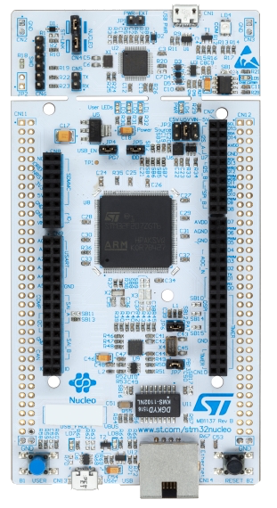
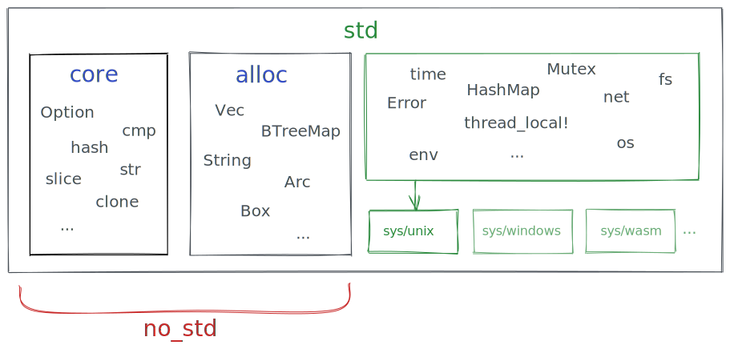

% Using `std` in embedded Rust
%
% 14th April 2021

I recently asked [a question](question.html) about using [the Rust `std` library](https://doc.rust-lang.org/std/) in microcontrollers. It was closed by the StackOverflow question Nazis (quelle surprise), but I have figured out the answer myself so I will post it here where they can't unilaterally execute it.

The question is: **Can you use `std` in embedded Rust programming?**

A lot of readers are probably instinctively thinking "you shouldn't do that!", often for reasons [like this](question.html):

> on a microcontroller you generally don't have enough memory to rely on a heap just being big enough for things like Vecs, so you just use arrays.

That's nonsense. Modern microcontrollers can have 1 MB of RAM or even more. That's the minimum requirement for Windows 3.0! Also it's common to use heap-allocated objects that are only allocated once at startup.

The real reason not to use a heap on microcontrollers is because it can fail at runtime, which on safety critical or high availability devices is a problem. But that doesn't apply in most applications. Mbed and Arduino have had heaps for years.


## My original motivation

My original motivation was to be able to use containers like [`Vec`](https://doc.rust-lang.org/std/vec/struct.Vec.html) and [`VecDeque`](https://doc.rust-lang.org/std/collections/struct.VecDeque.html). For some simple containers there is the [`heapless`](https://crates.io/crates/heapless) crate that provides non-heap versions of containers, but it doesn't cover everything - for example it doesn't include a version of `VecDeque`.

One of the StackOverflow comments pointed me to [an easier solution](https://docs.rust-embedded.org/book/collections/index.html): you can use [the `alloc` crate](https://doc.rust-lang.org/alloc/) (not to be confused with [`core::alloc`](https://doc.rust-lang.org/core/alloc/index.html)) even in `#![no_std]` programs. `alloc` contains most of the functionality from `std` you might want to use on bare metal that isn't in `core`. You just have to provide a memory allocator. A simple allocator is [`linked-list-allocator`](https://github.com/phil-opp/linked-list-allocator). Let's try it out!

## Trying out `alloc`



I followed the excellent [Rust Embedded Book's guide](https://docs.rust-embedded.org/book/start/qemu.html) to running a Cortex-M3 program on QEMU. Following the guide we get to the point where we can cross-compile the following example code to `thumbv7m-none-eabi` and run it.

```rust
#![no_main]
#![no_std]

use panic_halt as _;

use cortex_m_rt::entry;
use cortex_m_semihosting::{debug, hprintln};

#[entry]
fn main() -> ! {
    hprintln!("Hello, world!").unwrap();

    debug::exit(debug::EXIT_SUCCESS);
    loop {}
}
```

```shell
$ cargo run --release
Finished release [optimized + debuginfo] target(s) in 0.14s
 Running `qemu-system-arm -cpu cortex-m3 -machine lm3s6965evb -nographic -semihosting-config enable=on,target=native -kernel target/thumbv7m-none-eabi/release/cortex-m-quickstart`
Hello, world!
```

So far so good. What if we try to use the `alloc` crate?

```rust
#![no_main]
#![no_std]

use panic_halt as _;

use cortex_m_rt::entry;
use cortex_m_semihosting::{debug, hprintln};

extern crate alloc;   // 👈
use alloc::vec::Vec;  // 👈

#[entry]
fn main() -> ! {
    let mut v = Vec::new();                // 👈
    v.push(5);                             // 👈
    v.push(2);                             // 👈
    v.push(5);                             // 👈
    for x in v.iter() {                    // 👈
      hprintln!("Hello {}", x).unwrap();   // 👈
    }                                      // 👈

    debug::exit(debug::EXIT_SUCCESS);
    loop {}
}
```

Let's try it:

```shell
$ cargo run --release
    Compiling cortex-m-quickstart v0.1.0 (/Users/tim/cortex-m-quickstart)
 error: no global memory allocator found but one is required; link to std or add `#[global_allocator]` to a static item that implements the GlobalAlloc trait.

 error[E0554]: `#![feature]` may not be used on the stable release channel
  --> src/main.rs:3:1
   |
 3 | #![feature(alloc)]    // 👈
   | ^^^^^^^^^^^^^^^^^^
```

Ok there are two problems here:

1. `alloc` is unstable so we have to use nightly, and
2. we haven't provided an allocator.

To add the allocator we can uncomment the `cortex-m-alloc` dependency in `Cargo.toml`:

```toml
# Uncomment for the allocator example.
alloc-cortex-m = "0.4.0"
```

[`alloc-cortex-m`](https://github.com/rust-embedded/alloc-cortex-m) is a wrapper around `linked-list-allocator` that makes it interrupt safe for Cortex-M processors.

Then we can use it in the code. Conveniently there's [an example at `examples/allocator.rs`](https://github.com/rust-embedded/cortex-m-quickstart/blob/master/examples/allocator.rs) that we can copy & paste from:

```rust
#![no_main]
#![no_std]
#![feature(alloc_error_handler)] // 👈

use panic_halt as _;

use cortex_m_rt::entry;
use cortex_m_semihosting::{debug, hprintln};

extern crate alloc;
use alloc::vec::Vec;

use alloc_cortex_m::CortexMHeap;                        // 👈
                                                        // 👈
// this is the allocator the application will use       // 👈
#[global_allocator]                                     // 👈
static ALLOCATOR: CortexMHeap = CortexMHeap::empty();   // 👈
                                                        // 👈
const HEAP_SIZE: usize = 1024; // in bytes              // 👈

#[entry]
fn main() -> ! {
    // Initialize the allocator BEFORE you use it                             // 👈
    unsafe { ALLOCATOR.init(cortex_m_rt::heap_start() as usize, HEAP_SIZE) }  // 👈

    let mut v = Vec::new();
    v.push(5);
    v.push(2);
    v.push(5);
    for x in v.iter() {
      hprintln!("Hello {}", x).unwrap();
    }

    debug::exit(debug::EXIT_SUCCESS);
    loop {}
}

// define what happens in an Out Of Memory (OOM) condition     // 👈
#[alloc_error_handler]                                         // 👈
fn alloc_error(_layout: core::alloc::Layout) -> ! {            // 👈
    loop {}                                                    // 👈
}                                                              // 👈
```

Then compile using nightly:

```shell
$ rustup +nightly target add thumbv7m-none-eabi
info: downloading component 'rust-std' for 'thumbv7m-none-eabi'
info: installing component 'rust-std' for 'thumbv7m-none-eabi'
info: using up to 500.0 MiB of RAM to unpack components

$ cargo +nightly run --release
...
   Compiling cortex-m-quickstart v0.1.0 (/Users/tim/cortex-m-quickstart)
    Finished release [optimized + debuginfo] target(s) in 3.22s
     Running `qemu-system-arm -cpu cortex-m3 -machine lm3s6965evb -nographic -semihosting-config enable=on,target=native -kernel target/thumbv7m-none-eabi/release/cortex-m-quickstart`
Hello 5
Hello 2
Hello 5
```

Success! But what happens if we try to use `std::vec::Vec` instead? Unfortunately as soon as we comment out `#![no_std]` we get this error:

```shell
$ cargo +nightly run --release
   Compiling cortex-m-quickstart v0.1.0 (/Users/tim/cortex-m-quickstart)
error[E0463]: can't find crate for `std`
  |
  = note: the `thumbv7m-none-eabi` target may not be installed
```

## What about full `std`?

So this still left me wondering, what if I really do want to have `std` available? Can you do it? Let's try!

What determines if `std` is available? It is sort of dictated by the target you are compiling for. The target is described by a "target triple" which is a barely consistent tuple of up to four parts (yep it's inconsistent *and* badly named) describing the target architecture and platform that you are compiling for. There is a list of supported targets [here](https://doc.rust-lang.org/nightly/rustc/platform-support.html).

Notice that some of them do not support `std` (indicated by a `*`). For example `thumbv7m-none-eabi` which we are using does not, but `wasm32-unknown-unknown` does. Rust sensibly does not try to parse the target triple. Instead each target has a target spec, which you can print like this:

```shell
$ rustc +nightly -Z unstable-options --print target-spec-json --target
{
  "arch": "arm",
  "data-layout": "e-m:e-p:32:32-Fi8-i64:64-v128:64:128-a:0:32-n32-S64",
  "eliminate-frame-pointer": false,
  "emit-debug-gdb-scripts": false,
  "executables": true,
  "is-builtin": true,
  "linker": "rust-lld",
  "linker-flavor": "ld.lld",
  "llvm-target": "thumbv7m-none-eabi",
  "max-atomic-width": 32,
  "panic-strategy": "abort",
  "relocation-model": "static",
  "target-pointer-width": "32",
  "unsupported-abis": [
    "stdcall",
    "fastcall",
    "vectorcall",
    "thiscall",
    "win64",
    "sysv64"
  ]
}
```

```shell
$ rustc +nightly -Z unstable-options --print target-spec-json --target wasm32-unknown-unknown
{
  "arch": "wasm32",
  "crt-objects-fallback": "wasm",
  "data-layout": "e-m:e-p:32:32-i64:64-n32:64-S128",
  "default-hidden-visibility": true,
  "dll-prefix": "",
  "dll-suffix": ".wasm",
  "dynamic-linking": true,
  "eh-frame-header": false,
  "emit-debug-gdb-scripts": false,
  "exe-suffix": ".wasm",
  "executables": true,
  "has-elf-tls": true,
  "is-builtin": true,
  "limit-rdylib-exports": false,
  "linker": "rust-lld",
  "linker-flavor": "wasm-ld",
  "lld-flavor": "wasm",
  "llvm-target": "wasm32-unknown-unknown",
  "max-atomic-width": 64,
  "only-cdylib": true,
  "os": "unknown",
  "panic-strategy": "abort",
  "pre-link-args": {
    "gcc": [
      "-Wl,-z",
      "-Wl,stack-size=1048576",
      "-Wl,--stack-first",
      "-Wl,--allow-undefined",
      "-Wl,--fatal-warnings",
      "-Wl,--no-demangle",
      "--target=wasm32-unknown-unknown",
      "-Wl,--no-entry",
      "-Wl,--export-dynamic"
    ],
    "wasm-ld": [
      "-z",
      "stack-size=1048576",
      "--stack-first",
      "--allow-undefined",
      "--fatal-warnings",
      "--no-demangle",
      "--no-entry",
      "--export-dynamic"
    ]
  },
  "relocation-model": "static",
  "simd-types-indirect": false,
  "singlethread": true,
  "target-pointer-width": "32",
  "tls-model": "local-exec"
}
```

Note the line `"os": "unknown",`. According to [this comment](https://github.com/rust-lang/rust/blob/f900ee331dfe95493390e1beecb82a277158b60b/compiler/rustc_target/src/spec/mod.rs#L866):

```rust
    /// "none" implies a bare metal target without `std` library.
    /// A couple of targets having `std` also use "unknown" as an `os` value,
    /// but they are exceptions.
```

Roughly, targets with `"os": "none"` (which is the default) do not have `std` available. However that's not exactly how it works. You can actually build `std` for any target, even targets with `"os": "none"`. Let's see how.

## Standard library on a Cortex M3

Since the `thumbv7m-none-eabi` target does not come with a precompiled `std` installed we can use the `-Z build-std` option to tell Cargo to build `std` from source.
 `build-std` can be constrained to build only `core` or `core` and `alloc` but by default it builds `core`, `alloc` and `std` which is what we want.

```shell
$ cargo +nightly build -Z build-std
  error: "/Users/tim/.rustup/toolchains/nightly-x86_64-apple-darwin/lib/rustlib/src/rust/Cargo.lock" does not exist, unable to build with the standard library, try:
          rustup component add rust-src
```

Ok that makes sense, we need the source code for `std` to build it from source:

```shell
$ rustup component add rust-src
info: component 'rust-src' is up to date
```

Err...

```shell
$ rustup +nightly component add rust-src
info: downloading component 'rust-src'
info: installing component 'rust-src'
info: using up to 500.0 MiB of RAM to unpack components
```

Ah ok, fine.

```shell
$ cargo +nightly build -Z build-std
   Compiling core v0.0.0 (/Users/tim/.rustup/toolchains/nightly-x86_64-apple-darwin/lib/rustlib/src/rust/library/core)
   Compiling compiler_builtins v0.1.39
   Compiling libc v0.2.88
   Compiling unwind v0.0.0 (/Users/tim/.rustup/toolchains/nightly-x86_64-apple-darwin/lib/rustlib/src/rust/library/unwind)
   Compiling std v0.0.0 (/Users/tim/.rustup/toolchains/nightly-x86_64-apple-darwin/lib/rustlib/src/rust/library/std)
   Compiling typenum v1.13.0
   Compiling cortex-m v0.7.2
   Compiling bare-metal v0.2.5
...
   Compiling generic-array v0.13.3
   Compiling generic-array v0.12.4
   Compiling as-slice v0.1.5
   Compiling aligned v0.3.4
error[E0463]: can't find crate for `panic_abort`
```

This error stumped me. I thought I was doing wrong but eventually realised it happens even when using `build-std` for the `wasm32-unknown-unknown` target which is a `std`-enabled target. [It turns out it is a bug with `build-std`](https://github.com/rust-lang/rust/issues/83805#issuecomment-812874115). It doesn't know how to handle `panic_abort` vs `panic_unwind` so it doesn't use either crate, resulting in the above error. It can be fixed like this:

```shell
$ cargo +nightly build -Z build-std=std,panic_abort
   Compiling core v0.0.0 (/Users/tim/.rustup/toolchains/nightly-x86_64-apple-darwin/lib/rustlib/src/rust/library/core)
   Compiling cortex-m-quickstart v0.1.0 (/Users/tim/workspace/cortex-m-quickstart)
   Compiling compiler_builtins v0.1.39
   Compiling libc v0.2.88
   Compiling unwind v0.0.0 (/Users/tim/.rustup/toolchains/nightly-x86_64-apple-darwin/lib/rustlib/src/rust/library/unwind)
   Compiling std v0.0.0 (/Users/tim/.rustup/toolchains/nightly-x86_64-apple-darwin/lib/rustlib/src/rust/library/std)
   Compiling rustc-std-workspace-core v1.99.0 (/Users/tim/.rustup/toolchains/nightly-x86_64-apple-darwin/lib/rustlib/src/rust/library/rustc-std-workspace-core)
   Compiling alloc v0.0.0 (/Users/tim/.rustup/toolchains/nightly-x86_64-apple-darwin/lib/rustlib/src/rust/library/alloc)
   Compiling cfg-if v0.1.10
   Compiling adler v0.2.3
   Compiling rustc-demangle v0.1.18
   Compiling panic_abort v0.0.0 (/Users/tim/.rustup/toolchains/nightly-x86_64-apple-darwin/lib/rustlib/src/rust/library/panic_abort)
   Compiling rustc-std-workspace-alloc v1.99.0 (/Users/tim/.rustup/toolchains/nightly-x86_64-apple-darwin/lib/rustlib/src/rust/library/rustc-std-workspace-alloc)
   Compiling panic_unwind v0.0.0 (/Users/tim/.rustup/toolchains/nightly-x86_64-apple-darwin/lib/rustlib/src/rust/library/panic_unwind)
   Compiling gimli v0.23.0
   Compiling object v0.22.0
   Compiling miniz_oxide v0.4.0
   Compiling hashbrown v0.11.0
   Compiling addr2line v0.14.0
   Compiling proc_macro v0.0.0 (/Users/tim/.rustup/toolchains/nightly-x86_64-apple-darwin/lib/rustlib/src/rust/library/proc_macro)
error[E0658]: use of unstable library feature 'restricted_std'
  |
  = help: add `#![feature(restricted_std)]` to the crate attributes to enable

error: aborting due to previous error
```

There's [not much documentation on this error](https://doc.rust-lang.org/nightly/unstable-book/library-features/restricted-std.html), but I managed to figure out what this means.

Basically platform-dependent parts of `std` - such as threading and filesystem access - are in [the `sys` crate](https://github.com/rust-lang/rust/tree/master/library/std/src/sys). There is an implementation of `sys` inside `std` for each platform that Rust supports. The selected implementation [is determined mostly by the `os` field of the target spec](https://github.com/rust-lang/rust/blob/master/library/std/src/sys/mod.rs). If the `os` is `none` then it uses [the `unsupported` implementation](https://github.com/rust-lang/rust/tree/master/library/std/src/sys/unsupported) in which all operations fail or do nothing.



When `std` is built, if the target does not match [one of these whitelisted targets](https://github.com/rust-lang/rust/blob/master/library/std/build.rs) then the `restricted_std` feature is required to indicate that that build of `std` is not supported. I am not really sure why the whitelist does not match the logic for selecting the `sys` implementation but I'm sure there's a reason.

To tell Rust we're ok with using the unsupported `std`, just add `#![feature(restricted_std)]` at the start of `main.rs`.

```shell
$ cargo +nightly build -Z build-std=std,panic_abort
   Compiling cortex-m-quickstart v0.1.0 (/Users/tim/cortex-m-quickstart)
error: duplicate lang item in crate `panic_halt` (which `cortex_m_quickstart` depends on): `panic_impl`.
  |
  = note: the lang item is first defined in crate `std` (which `cortex_m_quickstart` depends on)
  = note: first definition in `std` loaded from /Users/tim/cortex-m-quickstart/target/thumbv7m-none-eabi/debug/deps/libstd-7973440d226ad430.rlib
  = note: second definition in `panic_halt` loaded from /Users/tim/cortex-m-quickstart/target/thumbv7m-none-eabi/debug/deps/libpanic_halt-9309434d713d3da0.rlib

error[E0152]: found duplicate lang item `oom`
  --> src/main.rs:41:1
   |
41 | fn alloc_error(_layout: core::alloc::Layout) -> ! {
   | ^^^^^^^^^^^^^^^^^^^^^^^^^^^^^^^^^^^^^^^^^^^^^^^^^
   |
```

`std` provides its own OOM handler so we can just delete that function. We also need to remove our custom panic handler. Comment out the dependency in `Cargo.toml`, and the `use` in `main.rs`:

```toml
# panic-halt = "0.2.0"
```

```rust
// use panic_halt as _;
```

The final code is

```rust
#![no_main]
#![feature(alloc_error_handler)]
#![feature(restricted_std)]

use cortex_m_rt::entry;
use cortex_m_semihosting::{debug, hprintln};

use alloc_cortex_m::CortexMHeap;

// this is the allocator the application will use
#[global_allocator]
static ALLOCATOR: CortexMHeap = CortexMHeap::empty();

const HEAP_SIZE: usize = 1024; // in bytes

#[entry]
fn main() -> ! {
    // Initialize the allocator BEFORE you use it
    unsafe { ALLOCATOR.init(cortex_m_rt::heap_start() as usize, HEAP_SIZE) }

    let mut v = Vec::new();
    v.push(5);
    v.push(2);
    v.push(5);
    for x in v.iter() {
      hprintln!("Hello {}", x).unwrap();
    }

    debug::exit(debug::EXIT_SUCCESS);
    loop {}
}
```

Note that I changed it to use `std::vec::Vec` instead of `alloc::vec::Vec`. Let's try it.

```shell
$ cargo +nightly build -Z build-std=std,panic_abort
   Compiling cortex-m-quickstart v0.1.0 (/Users/tim/cortex-m-quickstart)
    Finished dev [unoptimized + debuginfo] target(s) in 0.36s
```

It compiled! Does it run?

```shell
$ cargo +nightly run -Z build-std=std,panic_abort
    Finished dev [unoptimized + debuginfo] target(s) in 0.10s
     Running `qemu-system-arm -cpu cortex-m3 -machine lm3s6965evb -nographic -semihosting-config enable=on,target=native -kernel target/thumbv7m-none-eabi/debug/cortex-m-quickstart`
Hello 5
Hello 2
Hello 5
```

Oh my god it actually worked. We just compiled and ran a bare metal Cortex-M3 program that uses `std`. Take *THAT* StackOverflow know-it-alls.

## Why this isn't stupid

In most bare metal situations you only need `core` and `alloc`. `std` mostly exposes items from `core` or `alloc`. The exceptions are functions normally provided by an OS like [network access](https://doc.rust-lang.org/std/net/index.html), [running processes](https://doc.rust-lang.org/std/process/index.html) and [using files](https://doc.rust-lang.org/std/fs/index.html). Those things rely on [the `sys` crate](https://github.com/rust-lang/rust/tree/master/library/std/src/sys).

Those operations do make sense on bare metal! We might want to provide a virtual filesystem for example, and plenty of microcontrollers support network features. Unfortunately the implementations are all embedded in the compiler - there is no way to define your own though that [is planned eventually](https://github.com/rust-lang/rust/blob/master/library/std/src/sys/mod.rs#L16):

```rust
//! In the future it would be desirable for the independent
//! implementations of this module to be extracted to their own crates
//! that `std` can link to, thus enabling their implementation
//! out-of-tree via crate replacement. Though due to the complex
//! inter-dependencies within `std` that will be a challenging goal to
//! achieve.
```

However there are still some compelling reasons to use `std`:

1. [`HashMap` is only available in `std`.](https://github.com/rust-lang/rust/issues/27242)
2. [`Error` is only available in `std`.](https://github.com/rust-lang/rust/issues/62502)
3. You can use `std` crates.
4. [`async`/`await` only works in `std`](https://ferrous-systems.com/blog/embedded-async-await/)

Unfortunately there are some serious caveats so I would probably stick to `core` and `alloc` for now. Specifically:

1. You can't use `HashMap` with the default hasher because it uses `thread_local!()` which requires support from `sys`.
2. I think the same issue applies to `async`/`await` though I haven't tested it.
3. You actually can't use `std` dependencies because there's no way to pass `#[feature(restricted_std)]` to them as far as I can tell. Every crate needs that feature, not just the root one.

Anyway here is a simple program to demonstrate some `std`-only features.

```rust
#![no_main]
#![feature(alloc_error_handler)]
#![feature(restricted_std)]

use cortex_m_rt::entry;
use cortex_m_semihosting::{debug, hprintln};

use std::{
    collections::{HashMap, hash_map::DefaultHasher},
    hash::{BuildHasher, BuildHasherDefault},
};

                                                         // 👇
type Result<T> = std::result::Result<T, Box<dyn std::error::Error>>;

use alloc_cortex_m::CortexMHeap;

// this is the allocator the application will use
#[global_allocator]
static ALLOCATOR: CortexMHeap = CortexMHeap::empty();

const HEAP_SIZE: usize = 1024; // in bytes

#[entry]
fn main() -> ! {
    // Initialize the allocator BEFORE you use it
    unsafe { ALLOCATOR.init(cortex_m_rt::heap_start() as usize, HEAP_SIZE) }

             // 👇
    let mut v = HashMap::with_hasher(BuildHasherDefault::<DefaultHasher>::default());
    v.insert(1, 1);
    match get_zero(&v) {
        Ok(x) => hprintln!("Element 0 is {}", x).unwrap(),
        Err(e) => hprintln!("Error: {}", e).unwrap(),
    }

    debug::exit(debug::EXIT_SUCCESS);
    loop {}
}

fn get_zero<S: BuildHasher>(x: &HashMap<u32, u32, S>) -> Result<u32> {
    Ok(*x.get(&0).ok_or("Missing element 0")?)
}
```

```shell
$ cargo +nightly run -Z build-std=std,panic_abort
   Compiling cortex-m-quickstart v0.1.0 (/Users/tim/cortex-m-quickstart)
    Finished dev [unoptimized + debuginfo] target(s) in 1.22s
     Running `qemu-system-arm -cpu cortex-m3 -machine lm3s6965evb -nographic -semihosting-config enable=on,target=native -kernel target/thumbv7m-none-eabi/debug/cortex-m-quickstart`
Error: Missing element 0
```

Success! (It's supposed to print an error.)

It's not quite there yet but the *idea* of using `std` on bare metal isn't crazy. Hopefully one day we will be able to supply a custom `sys` crate for bare metal targets and easily use `std` everywhere.
